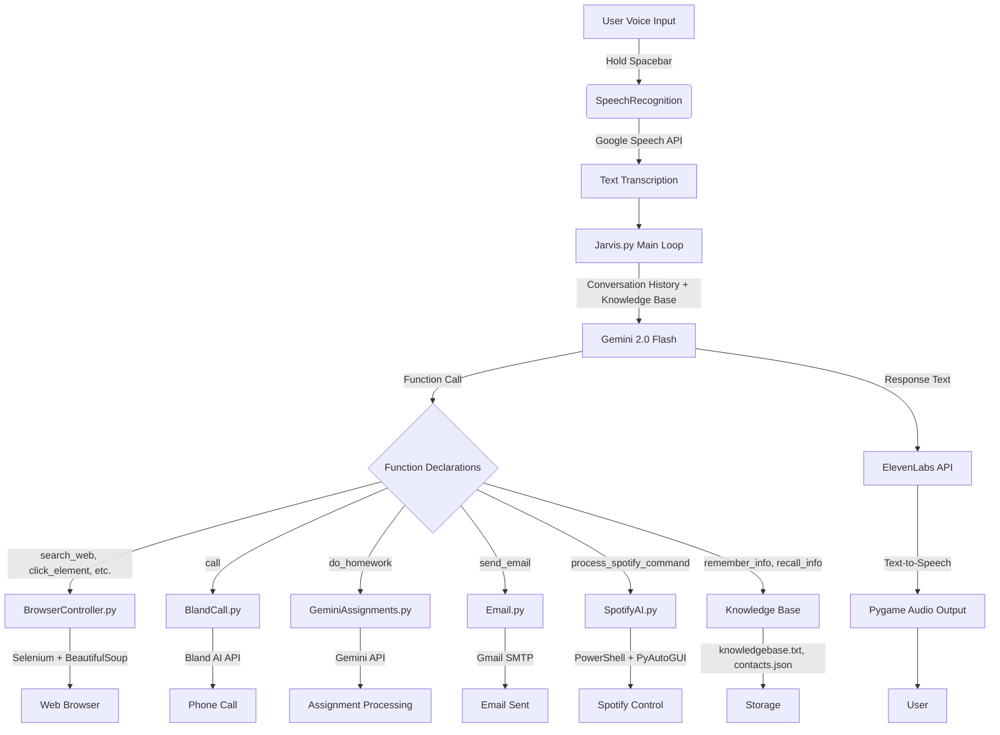

## User's Manual

JARVIS is a voice-activated AI assistant that integrates multiple APIs (Gemini, ElevenLabs, Bland AI, Gmail SMTP) and tools (Selenium, BeautifulSoup, PyAutoGUI) to provide a seamless experience. It is controlled via voice commands, with a focus on natural language interaction.

### Prerequisites

To use JARVIS, ensure the following:

#### 1. Hardware

* A computer running **Windows**.
* A microphone for voice input.

#### 2. Software

* Python 3.8+ installed.
* Google Chrome browser.

#### 3. Python Packages

Install all required packages listed in `requirements.txt`. If unavailable, install manually:

```bash
pip install -r requirements.txt
```

#### 4. API Keys and Credentials

Create a `.env` file based on `env_template`:

```env
GEMINI_API_KEY=<your_gemini_api_key>
BRIGHTSPACE_USERNAME=<your_brightspace_username>
BRIGHTSPACE_PASSWORD=<your_brightspace_password>
ELEVENLABS_API_KEY=<your_elevenlabs_api_key>
ELEVENLABS_VOICE_ID=<your_elevenlabs_voice_id>
SENDER_GMAIL=<your_gmail_address>
EMAIL_APP_PASSWORD=<your_gmail_app_password>
BLAND_API_KEY=<your_bland_api_key>
```

#### 5. ChromeDriver

Use `ChromeDriverManager.py` to update and ensure compatibility with installed Chrome version.

---

### Installation

1. **Clone the Repository**:

   ```bash
   git clone https://github.com/shibampokerail/JARVIS.git
   cd JARVIS
   ```

2. **Set Up Virtual Environment**:

   ```bash
   python -m venv venv
   source venv/bin/activate  # On Windows: venv\Scripts\activate
   ```

3. **Install Dependencies**:

   ```bash
   pip install -r requirements.txt
   ```

4. **Configure Environment**:
   Create a `.env` file
   Copy `env_template` to your `.env` and populate with your API keys.

6. **Run the Application**:

   ```bash
   python main.py
   ```

---

### Login and Interface

* **No GUI** – JARVIS uses a command-line interface.
* **Authentication** – Handled via `.env` credentials.
* **Startup** – Initializes ambient noise handling for \~5 seconds.
* **Interaction** – Hold spacebar, speak, release to issue a command.

---

### Sample Workflow: Research and Email

#### 1. Start JARVIS:

```bash
python main.py
```

#### 2. Say: (Remember to Hold Spacebar before you speak)

> "Research machine learning advancements."

* JARVIS fetches articles using Selenium + Bing.
* Summarizes content using Gemini API.
* Speaks summary via ElevenLabs.

#### 3. Then Say:

> "Send an email to John with the research summary."

* Uses email module and contacts knowledge base.
* Sends email via Gmail SMTP.

---

### Supported Commands

#### Web Navigation

* "Search for python tutorials."
* "Click the Images tab."

#### Research

* "Research quantum computing."

#### Homework

* "Do my homework for Artificial Intelligence."

#### Communication

* "Call Shibam about project meeting."
* "Send an email to [shalin@example.com](mailto:shalin@example.com) with the message: Meeting at 5 PM."

#### Spotify Control

* "Play Bohemian Rhapsody by Queen."
* "Pause the music."

#### Knowledge Base

* "Remember Shalin’s phone number is 1029318203."
* "What is Shalin’s phone number?"

#### Browser Actions

* "Close the current tab."
* "Scroll down."

---

### Tips for Users

* **Speak clearly** while holding spacebar.
* Use **specific commands** for best results.
* **Store contacts** in `contacts.json`.
* Say **"quit"** to exit safely.

---
---
---

## System's Manual

### Overview

JARVIS is a modular Python-based AI assistant that uses voice recognition, LLMs, and automation to perform tasks. `jarvis.py` is the core orchestrator.

---

### Software Components

* **Core Script (`bot/jarvis.py`)**:

  * Handles voice, NLP, function routing.
  * Uses Gemini API, Google Speech, and ElevenLabs.

* **Agents (`agents/`)**:

  * `BlandCall.py`: Uses Bland AI for calls.
  * `GeminiAssignments.py`: Homework tasks.

* **AI Tools (`ai_tools/`)**:

  * `Email.py`: Gmail SMTP support.
  * `SpotifyAI.py`: PowerShell + PyAutoGUI automation.

* **Utilities (`utils/`)**:

  * `BrowserController.py`: Web tasks via Selenium + BeautifulSoup.
  * `ChromeDriverManager.py`: ChromeDriver management.

* **Configuration (`bot/jarvis_config.py`)**:

  * Loads environment, initializes APIs.

* **Knowledge Base**:

  * Uses `knowledgebase.txt`, `contacts.json`.

---

### Dependencies

* **APIs**: Gemini, ElevenLabs, Bland AI, Gmail SMTP.
* **Libraries**: `speechrecognition`, `selenium`, `pyautogui`, `pygame`, `keyboard`, `dotenv`.

---

### Machine Learning Models

* **Gemini 2.0 Flash**:

  * Handles intent recognition and summarization.

* **Google Speech Recognition**:

  * Converts voice to text.

* **ElevenLabs**:

  * Converts text to speech.

> *No custom models used; relies on cloud APIs.*

---

### Workflow

1. **Voice Input**:

   * Captured and transcribed.

2. **Intent Processing**:

   * Gemini interprets and maps to functions.

3. **Function Execution**:

   * Calls appropriate module.

4. **Response Generation**:

   * ElevenLabs generates audio; printed and played.

5. **State Management**:

   * Maintains history and updates knowledge base.

---

### Architecture Diagram



---

### Integration Highlights

* **Selenium & BeautifulSoup**: Used for dynamic page interaction.
* **Gemini API**: Intent parsing + summarization.
* **ElevenLabs**: Voice responses.
* **Bland AI**: Phone calls.
* **Knowledge Base**: Contextual awareness.

---

### Limitations

* **Windows Dependency**: For Spotify and driver handling.
* **Error Handling**: API failures may halt flow.
* **No Multi-User Support**.
* **Sensitive Info**: `.env` must be secured.

---

## License

This documentation is licensed under the MIT License. See the `LICENSE` file for details.

---

## GitHub Integration Instructions

### 1. **Single File Approach**

* Save this file as `DOCS.md`.
* Add and push to repo:

```bash
git add DOCS.md
git commit -m "Add user and system manuals"
git push origin main
```

### 2. **Split Files**

* `USER_MANUAL.md`: Copy User's Manual content.
* `SYSTEM_MANUAL.md`: Copy System's Manual content.

```bash
git add USER_MANUAL.md SYSTEM_MANUAL.md
git commit -m "Add separate user and system manuals"
git push origin main
```

### 3. **README.md Links**

```markdown
## Documentation
- [User's Manual](USER_MANUAL.md)
- [System's Manual](SYSTEM_MANUAL.md)
```

*or:*

```markdown
## Documentation
- [User and System Manuals](DOCS.md)
```

---

